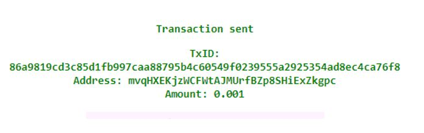
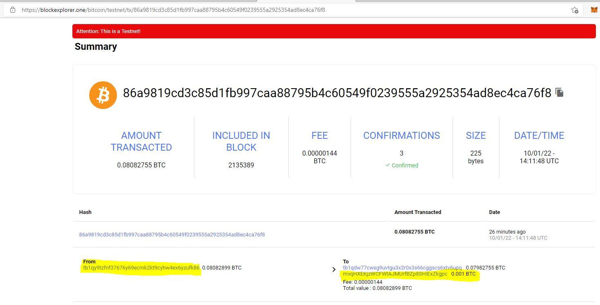
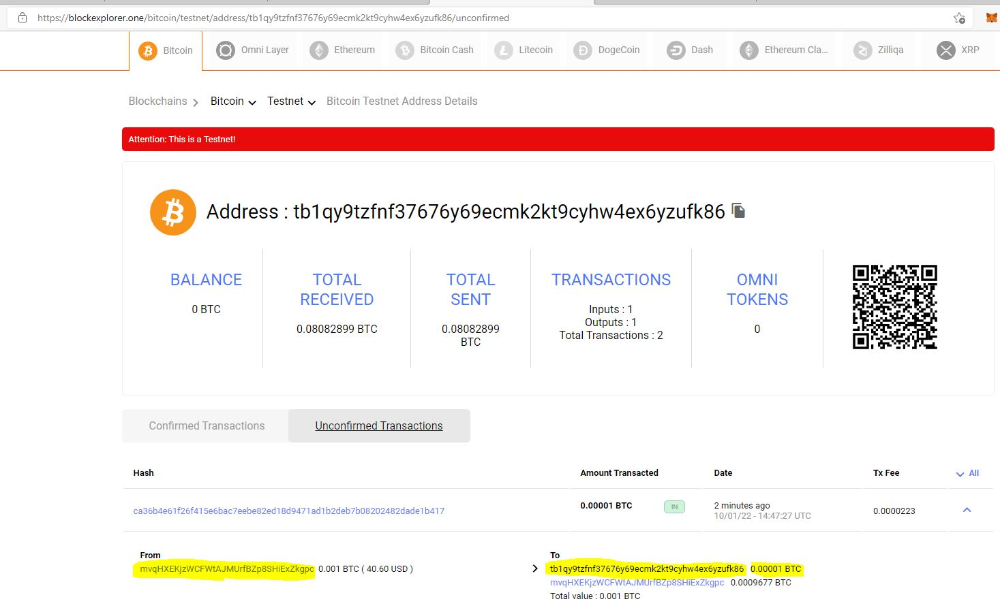

# Multi-Blockchain Wallet in Python


The purpose of this repo is to demonstrate how HD wallets work. We will do this by using command line tool, `hd-wallet-derive` which 
supports not only BIP32, BIP39, and BIP44, but also supports non-standard derivation paths for the most popular wallets available. 

This project aims to integrated a "universal" wallet using the HD Wallet Derive tool to demonstrate how we can use it to manage billions of addresses across 300+ coins.

## Dependencies

The following dependencies are required for this project: 

> **Important:** If you have _not_ already installed the dependencies listed below, you may do so by following the instructions found in the following guides:
  > - Install HD Wallet Derive: Setup instructions can be found here:
 <a href="https://monash.bootcampcontent.com/monash-coding-bootcamp/monu-virt-fin-pt-08-2021-u-c/-/blob/master/02-Homework/19-Blockchain-Python/Homework/Resources/HD_Wallet_Derive_Install_Guide.md">HD Wallet Installation</a>

 > - run: pip install -r requirements.txt


  > - [Blockchain TX Installation Guide](Resources/Blockchain_TX_Install_Guide.md).

**Dependencies List:**
- PHP must be installed on your operating system.

- You will need to clone the [`hd-wallet-derive`](https://github.com/dan-da/hd-wallet-derive) tool.

- [`bit`](https://ofek.github.io/bit/) Python Bitcoin library.

- [`web3.py`](https://github.com/ethereum/web3.py) Python Ethereum library.


<br><br>

# Setting Up Symbolic Linking
Having successfully setup php and HD Wallet Derive, perform the following steps to apply symbolic linking to enable direct execution of HD Wallet from within python by executing the commands below from within the 'wallet' directory using Git Bash:

- export MSYS=winsymlinks:nativestrict
- ln -s hd-wallet-derive/hd-wallet-derive.php derive

To test symbolic linking is functional, execute the command:
>- ./derive --key=xprv9zbB6Xchu2zRkf6jSEnH9vuy7tpBuq2njDRr9efSGBXSYr1QtN8QHRur28QLQvKRqFThCxopdS1UD61a5q6jGyuJPGLDV9XfYHQto72DAE8 --cols=path,address --coin=ZEC --numderive=3 -g

<br>

# Funding the BTC Testnet Account

The screenshot below describes the funding and confirmation for the deposit to the BTC Testnet account:




<br>

# Transfer Funds via Python

The following are the python command codes to execute the transfer:


```python

# Transfer 0.00001BTC
to = 'tb1qy9tzfnf37676y69ecmk2kt9cyhw4ex6yzufk86'
transfer = send_tx(btc_test, account, to, 0.00001)


```

## transfer confirmation:


** Please see wallet.ipynb to see code executions for the transfers
